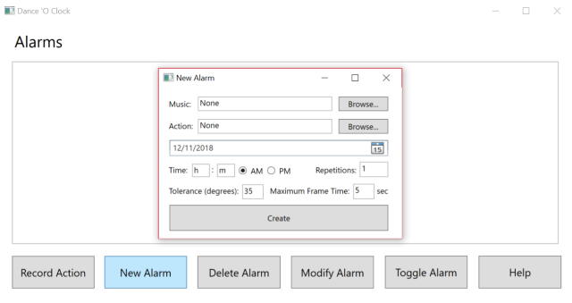
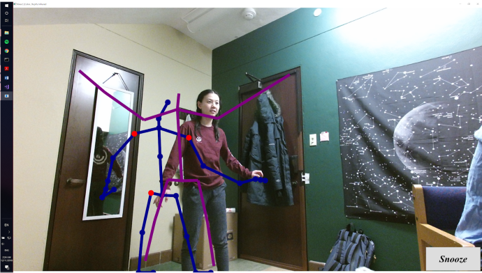

### Dance O'clock: Movement-deactivated Alarm Clock Using The Microsoft Kinect :dancers::alarm_clock:

**_The findings for the case study encompassing this project can be viewed as a PDF in this repository [here](danceoclock_paper.pdf)._**

## Introduction
College students are perennially exhausted, and getting out of bed is often a painful ordeal involving several sound-based alarms that are frequently snoozed or slept through. To alleviate the struggles faced by students in waking up in the morning, we introduce Dance O’clock, a motion-deactivated alarm clock program that utilizes the motion-capture capabilities of the Microsoft Kinect. Dance O'clock's capabilities include: recording a physical movement routine using the Kinect camera, setting an alarm with a series of user-customized parameters, and deactivation of a set alarm by performing the previously recorded movements. 

Dance O'clock was designed and developed from the holistic perspective of human-computer interaction; the original design was built upon an initial questionnaire of 26 college students around the world, which gauged their needs and feelings towards a movement-deactivated alarm system, and throughout the development process, the design components and functionalities were constantly adjusted accoring to real-time feedback from potential users. 

Dance O'clock was programmed by Andrew Li and Shana Li in C# in a Visual Studio environment and using the Microsoft Kinect SDK, along with the Microsoft Kinect 2.0 sensor. This project would not be possible without [Vangos Pterneas' tutorials for developing applications with the Kinect SDK](https://pterneas.com/), or professor [Cynthia Taylor's](https://cs.oberlin.edu/~ctaylor/) unwavering support and guidance.

## Requirements
- A computer running Windows 10 with an HDMI 1.4+ port
- A Microsoft Kinect 2.0 sensor
- Visual Studio 2015 or later

## Setup

Obtain the latest version of Dance O'clock:
```
git clone https://github.com/AndrewYinLi/danceoclock.git
```

Build from source from the Visual Studio solution or execute the program directly. The solution path should be as follows: 'danceoclock/danceoclock.sln'

## How to Use Dance O'clock
1. Open and read the help menu, which has helpful tips and instructions for using the program.
2. Record an action using the Kinect camera, and specify the length of recording, frame sample rate (these are the frames that are saved and matched with the frames that are performed during alarm deactivation), and the file saving options. The saved files contain the angles between limbs at each important body joint, which is captured at the specified sample rate by the Kinect sensor. The Dance O'clock package includes five preset movements.
3. Create and set up a new alarm with a selected recorded action, along with any valid .mp3 file to play as the alarm sound. The Dance O'clock package includes three preset alarm sounds.

4. Modify any of the alarm’s settings.
5. Wait for the alarm to go off, and then perform the required actions to deactivate the alarm with the visual guidance of a colored skeleton, as well as a different skeleton displaying user movement and indicating incorrect joint angles.

## Questions? Comments?
Feel free to reach out to us at ali@oberlin.edu and sli2@oberlin.edu. Moreover, the findings for the case study encompassing this project can be viewed as a PDF in this repository [here](danceoclock_paper.pdf).
